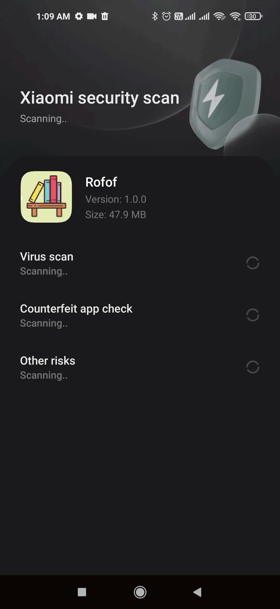

# 📚 Rofof – Advanced E-Library App

**Rofof** is a high-performance, cross-platform e-library application built with Flutter. It provides a seamless reading experience by integrating the **Google Books API** with a robust **Firebase backend**, focusing on data integrity, offline resilience, and personalized user experiences.

---
| **Smart Personalization & Instant Sync** | **Live Demo** |
| :--- | :---: |
| **1. Cold Start Context:**   The app intelligently adopts device native settings (e.g., **Dark Mode** & **English**) on the very first run.    **2. Dynamic Cloud Override:**   Immediately after login, the system fetches user preferences via **UID** and overwrites defaults with saved settings (e.g., **Light Mode** & **Arabic**) without a restart. |  |

---

| **High-Performance Search Engine** | **Live Search Demo** |
| :--- | :---: |
| **1. Real-time Live Suggestions:**   Implemented search-as-you-type functionality for instant user feedback.    **2. Smart LRU Search History:**   Engineered a **Least Recently Used (LRU)** logic to manage local history, ensuring the most relevant and recent searches stay on top while maintaining memory efficiency.    **3. Optimized Debounced Requests:**   Integrated **Debouncing** (300ms-500ms) to prevent API spamming, significantly reducing server load and improving UI responsiveness. |  |

---

| **Multi-Device & User Context Sync** | **Cross-Platform Sync Demo** |
| :--- | :---: |
| **1. Multi-User Firebase Authentication:**   Dedicated local environments, settings, and favorites for each Google account using **Firebase Auth**.    **2. Cloud-Synced Preferences:**   Themes (Dark/Light) and Language settings are stored in **Cloud Firestore**, ensuring the user's custom environment is ready on any new device.    **3. Reliable Data Integrity:**   Engineered a robust logic for **Seamless Merging** between the local SQL state and cloud data to prevent data loss during account switching. |  |

---

| **Resilient Offline-First Architecture** | **Network Resilience Demo** |
| :--- | :---: |
| **1. Dual-Layer Local Persistence:**   Optimized data storage by leveraging **Sqflite** for complex relational book data and **GetStorage** for high-speed access to user preferences.    **2. Robust Background Synchronization:**   Engineered a **Queue-Based logic** where offline actions (e.g., toggling favorites) are cached locally and automatically pushed to the cloud once a stable connection is detected.    **3. Interruption-Free UX:**   Guaranteed a seamless browsing experience; users can access cached content and search history during network outages without any UI blocking. |  |

---

## 🚀 Key Technical Features

### 🔍 1. Smart Search Engine
Engineered a sophisticated search system that prioritizes user speed and data efficiency:
* **Live Suggestions:** Real-time search-as-you-type functionality.
* **LRU Search History:** Implemented **Least Recently Used (LRU) Logic** to manage search history, ensuring that the most relevant and recent searches are always at the top.
* **Debounced Requests:** Optimized API calls to reduce server load and improve performance.

### 🔄 2. Real-time Cloud Synchronization
Ensured a consistent experience across multiple devices and accounts:
* **Multi-User Profiles:** Dedicated settings and favorites for each Google account using **Firebase Authentication**.
* **Preference Sync:** Themes (Dark/Light mode) and Language settings are synced to **Cloud Firestore**, allowing users to find their environment ready on any device.
* **Data Integrity:** Seamlessly merging local state with cloud data.

### 📶 3. Offline-First Architecture
Designed to work flawlessly in unreliable network conditions:
* **Local Persistence:** Leveraged **sqflite** for caching heavy book data and **GetStorage** for lightweight user preferences.
* **Background Sync:** Actions performed offline (like adding to favorites) are queued and automatically synchronized once the connection is restored.
* **Seamless UX:** Users can browse cached content and history without interruption during network outages.

### 🧠 4. State Management & Architecture
* **GetX Expertise:** Utilized GetX for reactive UI updates, efficient dependency injection, and clean route management.
* **Performance Optimization:** Implemented a **10-by-10 Pagination** strategy using **Dio** to fetch data in chunks, significantly reducing initial load times and memory consumption.
* **Clean Code:** Adhered to OOP principles and clean architecture to ensure the codebase is maintainable and scalable.

---

## 🛠 Tech Stack
* **Frontend:** Flutter & Dart
* **State Management:** GetX
* **Backend:** Firebase (Firestore, Auth)
* **Networking:** Dio (REST API)
* **Local Database:** sqflite & GetStorage
* **Utilities:** Google Sign-In, Localization (En/Ar)

---

## 📺 Demo Videos

| 🌐 Cloud Sync & Preferences | 📱 Offline-First Logic |
|---|---|
| <video src="https://github.com/mohamed151200/Rofof/blob/main/assets/videos/sync%20fav.mp4" width="350"> | <video src="https://github.com/mohamed151200/Rofof/blob/main/assets/videos/offline.mp4" width="350"> |

| 🔍 Smart Search Engine | 👥 Multi-Account Isolation |
|---|---|
| <video src="https://github.com/mohamed151200/Rofof/blob/main/assets/videos/searching%20history.mp4" width="350"> | <video src="https://github.com/mohamed151200/Rofof/blob/main/assets/videos/sync%20settings.mp4" width="350"> |

---

## 👷 Technical Challenges & Solutions
* **Challenge:** Handling data conflicts when the user switches accounts.
* **Solution:** Implemented a reactive listener that clears local cache and re-fetches preferences based on the new `UID` from Firebase Auth.

---

## ✉️ Contact
**Mohamed Khaled Saleh** *Computer and Systems Engineer* [LinkedIn](https://www.linkedin.com/in/mohamed-khaled-saleh-328438344/) | [Email](mailto:mohamedkhaledsaleh314@gmail.com)